<div align="center">


# LMAdmin · React Antd Luminous Admin

一个开箱即用、注重开发体验的现代化中后台管理系统模板。

基于 **React 19 + Ant Design 6 + Vite 7 + Zustand 5**，内置动态路由权限、完整系统管理模块、丰富的自研业务组件与示例页面，自带 Mock 数据，克隆即可启动。


</div>

---

## 目录

- [✨ 特性](#-特性)
- [🛠 技术栈](#-技术栈)
- [🚀 快速开始](#-快速开始)
- [🔑 默认账号](#-默认账号)
- [📸 页面预览](#-页面预览)
- [📂 项目结构](#-项目结构)
- [🧩 核心组件](#-核心组件)
- [📦 功能模块](#-功能模块)
- [🎨 主题定制](#-主题定制)
- [📊 状态管理](#-状态管理)
- [🧰 工具集](#-工具集)
- [🔌 Mock API](#-mock-api)
- [⚙️ 环境变量](#️-环境变量)
- [🤝 贡献指南](#-贡献指南)
- [📄 License](#-license)

---

## ✨ 特性

- **技术栈** — React 19、Ant Design 6、Vite 7、TypeScript 5.9、Zustand 5、TanStack Query 5、TailwindCSS 3
- **动态路由与权限** — 登录后根据后端返回的菜单树动态生成路由，配合 `AuthGuard` 实现完整的登录鉴权流程
- **权限管理闭环** — 用户 / 角色 / 菜单管理，角色可勾选菜单权限，观察不同角色的菜单差异
- **完整的系统管理模块** — 用户、角色、菜单、部门、岗位、字典、登录日志、操作日志、网站配置
- **暗黑模式 + 主题定制** — 一键切换深色 / 浅色，6 种预设主题色 + 自定义色，基于 View Transitions API 的圆形扩散动画
- **丰富的自研组件库** — ProForm、ProTable、ProModal、ProUpload、ModalSelector、Calendar、Chart、Card、Banner 等
- **数据看板** — 统计卡片（迷你趋势图）、ECharts 图表（柱状 / 环形 / 面积 / 仪表盘）、深度分析、排行榜，随机模拟数据实时刷新
- **开箱即用** — 内置 Mock API（30 条用户数据 + 分页等），无需后端即可完整体验所有功能
- **响应式布局** — 移动端侧边栏自动切换为抽屉模式

---

## 🛠 技术栈

| 分类      | 技术                                                                                                     |
| --------- | -------------------------------------------------------------------------------------------------------- |
| 核心框架  | [React 19](https://react.dev) · [TypeScript 5.9](https://www.typescriptlang.org)                         |
| UI 组件库 | [Ant Design 6](https://ant.design) · [@tabler/icons-react](https://tabler.io/icons)                      |
| 构建工具  | [Vite 7](https://vite.dev)                                                                               |
| 路由      | [React Router 7](https://reactrouter.com)                                                                |
| 状态管理  | [Zustand 5](https://zustand-demo.pmnd.rs)                                                                |
| 数据请求  | [Axios](https://axios-http.com) · [@tanstack/react-query](https://tanstack.com/query)                    |
| 样式方案  | [TailwindCSS 3](https://tailwindcss.com) · Sass                                                          |
| 图表      | [ECharts 6](https://echarts.apache.org)                                                                  |
| 动画      | [framer-motion 12](https://www.framer.com/motion/) · [animate.css](https://animate.style)                |
| 拖拽      | [@dnd-kit](https://dndkit.com) · [react-draggable](https://github.com/react-grid-layout/react-draggable) |
| 其他      | dayjs · crypto-js · jsencrypt · canvas-confetti · artplayer · react-easy-crop · exceljs · mitt · ahooks  |

---

## 🚀 快速开始

### 环境要求

- Node.js ≥ 18
- [pnpm](https://pnpm.io) ≥ 8（项目使用 pnpm 管理依赖）

### 安装与运行

```bash
# 克隆项目
git clone https://github.com/luminous0220/react-antd-luminous-admin.git
cd react-antd-luminous-admin

# 安装依赖
pnpm install

# 安装过程中如果出现 【Ignored build scripts: esbuild@0.11.3, esbuild@0.28.2】警告，请执行：
pnpm approve-builds
然后选择esbuild，输入 y，按下回车确认

# 启动开发服务器（自带 Mock API，端口见 .env 中的 VITE_PORT）
pnpm dev

# 类型检查 + 生产构建（禁用 Mock）
pnpm build

# 预览生产构建
pnpm preview

# 代码检查
pnpm lint

```

---

## 🔑 默认账号

| 账号    | 密码     |
| ------- | -------- |
| `admin` | `123456` |

登录表单默认已预填，点击「登录」即可进入。

---

## 📸 页面预览

> 以下截图基于内置 Mock 数据，开发环境 `pnpm dev` 启动后即为同款效果。

| 浅色 · 数据看板                                | 深色 · 数据看板                                     |
| ---------------------------------------------- | --------------------------------------------------- |
| 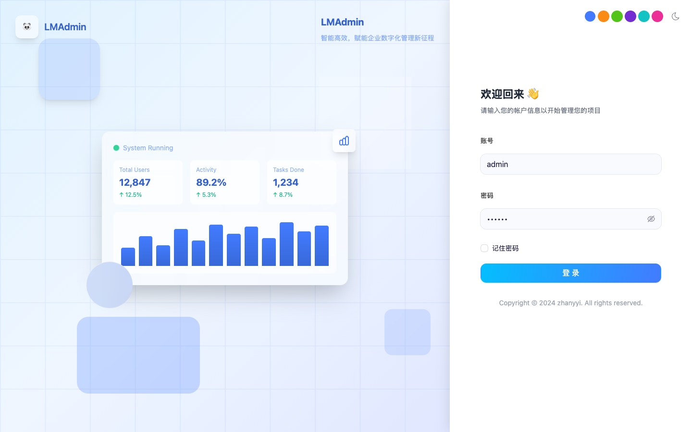       | 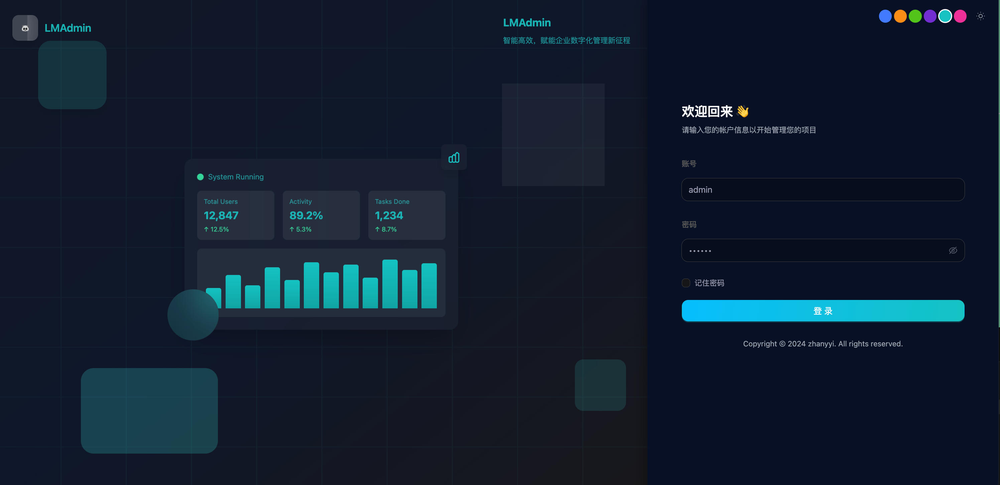     |
| 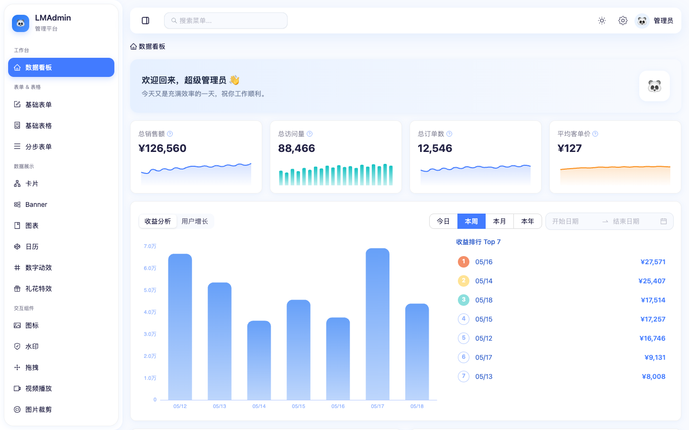 | 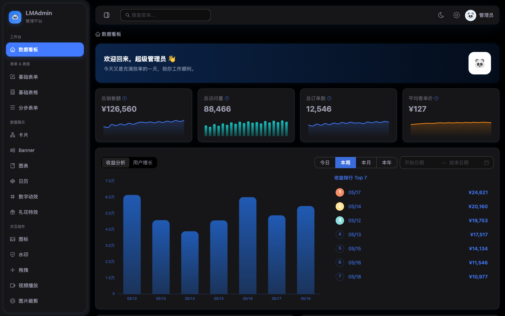 |
| 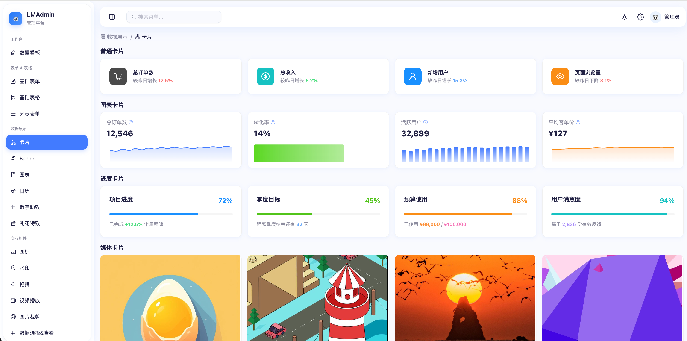     | 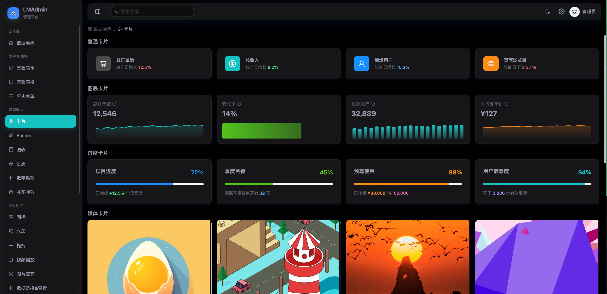    |
| 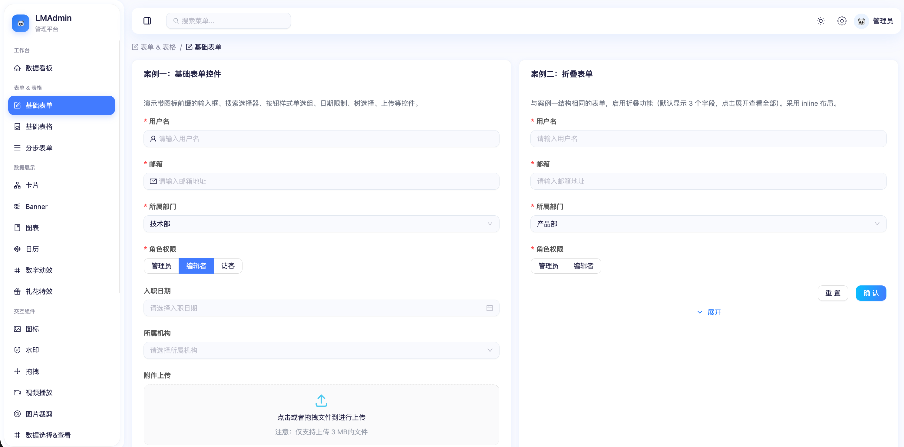      | 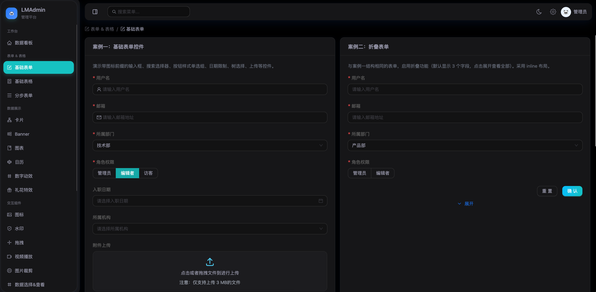      |
| 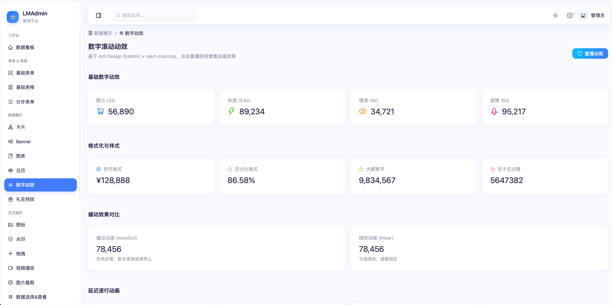         | 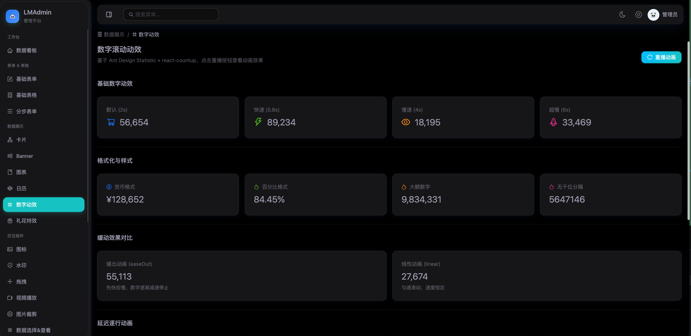         |
| 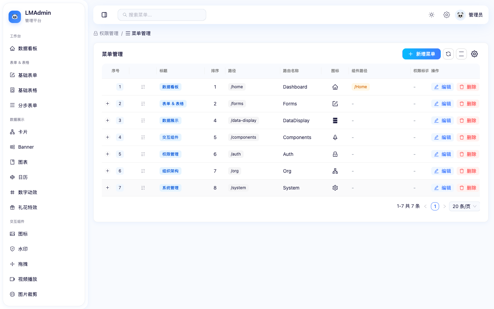      | 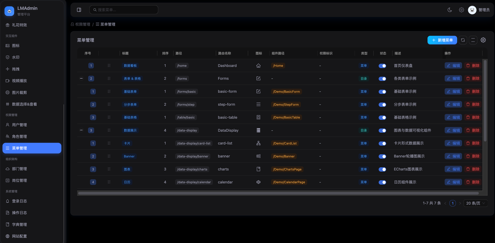      |
| 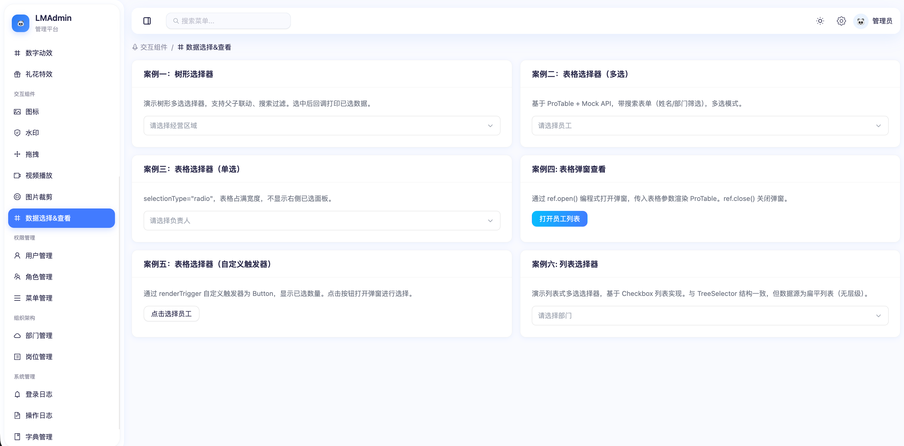    | 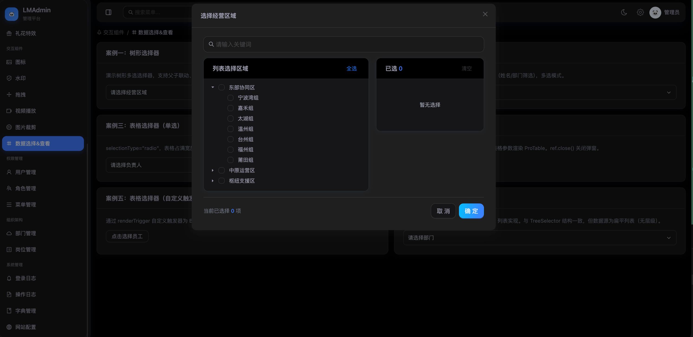    |
| 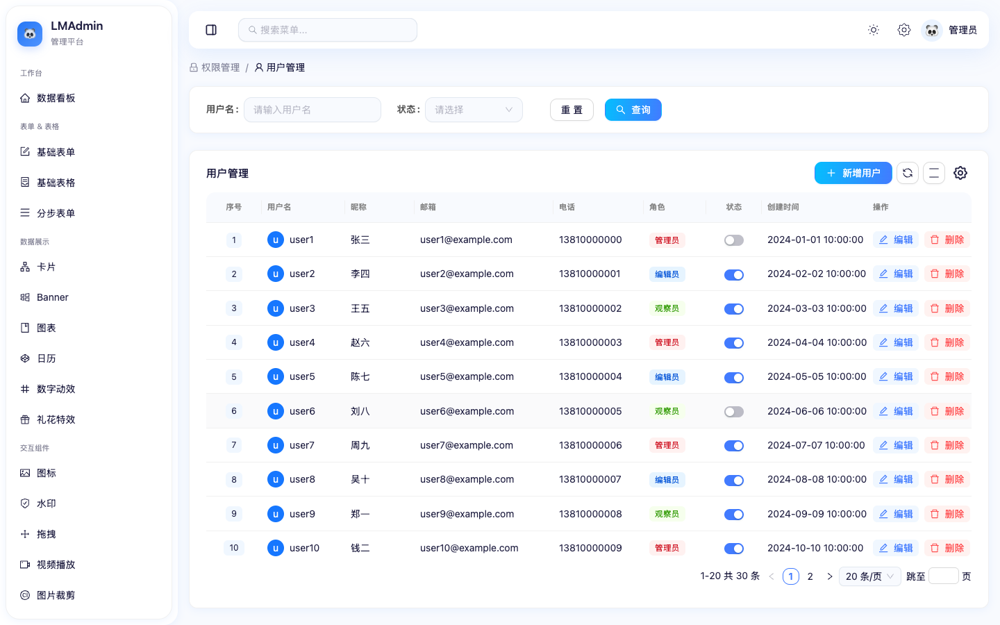      | 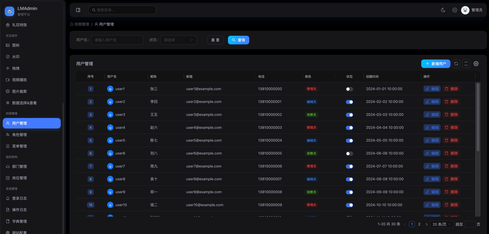      |

---

## 📂 项目结构

```shell
src/
├── apis/               # 接口层（Api 对象 + namespace IApi 类型定义）
├── components/         # 公共通用组件（ProForm / ProTable / ProModal / ...）
├── constants/          # 全局常量（CFG 对象）与枚举（enum）
├── hooks/              # 全局公共 Hooks
├── layout/             # 整体布局（侧边栏、顶部栏）
├── libs/               # 工具函数（请求封装、存储、事件总线、图标集...）
├── mock/               # Mock API（仅开发环境生效）
├── pages/              # 路由组件
│   ├── Home/           # 数据看板
│   ├── System/         # 系统管理（用户 / 角色 / 菜单 / 部门 / 岗位 / 字典 / 日志 / 配置）
│   └── Demo/           # 示例页面
├── routers/            # 路由配置（AuthGuard、动态路由生成）
├── stores/             # 全局状态管理（Zustand）
├── styles/             # 样式文件
├── types/              # 全局类型声明
├── App.tsx             # 应用入口（主题、QueryClient、AntD ConfigProvider）
└── main.tsx            # 挂载入口
```

> 目录说明：`components` 使用大驼峰命名，主文件 `index.tsx` 使用命名导出并统一导出模块内文件；组件类型统一放在 `types.d.ts`，工具函数与常量放在 `utils.ts`。

---

## 🧩 核心组件

| 组件                                            | 说明                                                                                                                                                                                  |
| ----------------------------------------------- | ------------------------------------------------------------------------------------------------------------------------------------------------------------------------------------- |
| [ProForm](src/components/ProForm)               | 基于配置数组（`FormFieldItem[]`）的表单构建器，支持 Input / Select / DatePicker / 自定义渲染等，通过 ref 暴露 `validateFields()` / `setFieldsValue()`，内置弹窗 / 抽屉 / 内联多种形态 |
| [ProTable](src/components/ProTable)             | 基于 `@dnd-kit` 的表格，支持拖拽排序，内置工具栏、选中统计、可复制单元格                                                                                                              |
| [ProModal](src/components/ProModal)             | 基于 ProForm 配置的弹窗表单（自定义弹窗，非 AntD Modal）                                                                                                                              |
| [ProUpload](src/components/ProUpload)           | 文件上传组件                                                                                                                                                                          |
| [ModalSelector](src/components/ModalSelector)   | 模态选择器，支持 List / Table / Tree 三种模式                                                                                                                                         |
| [Calendar](src/components/Calendar)             | 日历组件，带提醒功能（Zustand 持久化到 localStorage）                                                                                                                                 |
| [Chart](src/components/Chart)                   | ECharts 封装，`useChartColors()` 自动适配深色 / 浅色模式                                                                                                                              |
| [Card](src/components/Card)                     | 卡片变体：StatCard（迷你图表）、MediaCard、ListCard、NormalCard、ProgressCard                                                                                                         |
| [Banner](src/components/Banner)                 | 推广横幅，10 种颜色预设，弧形装饰带 CSS 动画                                                                                                                                          |
| [ThemeToggle](src/components/ThemeToggle)       | 深浅色切换按钮，使用 View Transitions API 圆形扩散动画                                                                                                                                |
| [ThemePanel](src/components/ThemePanel)         | 主题设置面板（深色开关 + 主题色选择器）                                                                                                                                               |
| [Drag](src/components/Drag)                     | 通用拖拽包裹组件                                                                                                                                                                      |
| [IconSelect](src/components/IconSelect)         | 图标选择组件，从图标集中选取                                                                                                                                                          |
| [TableModalView](src/components/TableModalView) | 表格数据弹窗查看组件                                                                                                                                                                  |

---

## 📦 功能模块

### 数据看板（`/home`）

- 统计卡片：总销售额、总访问量、总订单数、平均客单价（含迷你折线 / 柱状趋势图）
- 分类销售额（横向柱状图）、流量来源占比（环形图）、实时销售额趋势（面积图）
- 深度分析：今日 / 本周 / 本月 / 本年 多维度数据对比 + 排行榜

### 权限管理（`/auth`）

- **用户管理**：分页、搜索、增删改
- **角色管理**：增删改，支持为角色勾选菜单权限
- **菜单管理**：树形菜单 CRUD，支持调整父子关系

> 菜单数据驱动路由：后端 / Mock 返回的菜单树经 `filterAndSortMenus` 处理后，既渲染为侧边栏菜单，又通过 `generateRoutes` 动态生成路由，组件按 `componentPath` 懒加载。

### 系统管理（`/system`）

- 部门管理（树形）、岗位管理
- 字典管理（字典类型 + 字典数据）
- 登录日志、操作日志（分页 + 多条件筛选）
- 网站配置

### 示例页面（`/demo`）

基础表单、分步表单、基础表格、卡片列表、Banner、图表、日历、数字动效、礼花特效、图标集、水印、拖拽、视频播放、图片裁剪、数据选择 & 查看

---

## 🎨 主题定制

主题由 `src/stores/theme.ts` 统一管理，持久化到 localStorage：

- **深色 / 浅色切换**：全局 `dark` 类 + AntD `darkAlgorithm`，`syncThemeToDOM()` 同步到 `document`
- **主题色**：6 种预设色（蓝 / 橙 / 绿 / 紫 / 青 / 品红）+ 自定义色
- **颜色衍生**：`generateColorVariants()` 根据主色生成 `--theme-*` CSS 变量，供组件和 ECharts 图表使用

---

## 📊 状态管理

使用 Zustand，通过 `src/stores/index.ts` 统一导出，共四个 Store：

- **auth**（`useAuthStore`）— 登录状态、用户信息、菜单树（`devtools` 中间件，不持久化）
- **theme**（`useThemeStore`）— 深色模式、主题色、颜色衍生值（持久化到 `theme-storage`）
- **global**（`useGlobalStore`）— `isMobile` 响应式标志
- **calendar**（`useCalendarStore`）— 日历提醒的增删改查（持久化到 `calendar-storage`）

---

## 🧰 工具集

- `src/libs/request.ts` — Axios 单例封装（请求拦截自动携带 token，统一错误提示、401 处理）
- `src/libs/storage.ts` — 支持 TTL 过期的 localStorage / sessionStorage 封装
- `src/libs/mitt.ts` — 类型安全的事件总线
- `src/libs/iconMap.tsx` — 全局图标集
- `src/libs/index.ts` — 通用工具函数（树形数据处理、防抖 resize 等）
- `src/hooks/` — `useChartColors`、`useEcharts`、`useCountUp`、`useQueryPro`、`useFullLoading`、`useMessage`

---

## 🔌 Mock API

项目内置 `@meadmin-cn/vite-plugin-mock`，**仅在开发环境（`vite dev`）生效**，数据位于 `src/mock/index.ts`，包含：

- 登录、权限菜单、用户 CRUD（30 条模拟数据 + 分页）
- 角色 CRUD、角色权限分配、菜单 CRUD
- 部门、岗位、字典（类型 + 数据）CRUD
- 登录日志、操作日志、网站配置
- 首页仪表盘与深度分析（随机生成数据）

> 新增 API 接口时，请同步更新 `src/mock/index.ts` 与 `src/apis/type.d.ts` 中的类型定义，保证无后端时应用可完整运行。

---

## ⚙️ 环境变量

配置位于 `.env.development`：

| 变量                             | 说明                                | 默认值  |
| -------------------------------- | ----------------------------------- | ------- |
| `VITE_PORT`                      | 开发服务器端口                      | `9001`  |
| `VITE_BASE_URL`                  | 线上接口地址前缀                    | `/base` |
| `VITE_DROP_CONSOLE_AND_DEBUGGER` | 生产环境是否移除 console / debugger | `false` |
| `VITE_GZIP_COMPRESS`             | 生产环境是否启用 gzip               | `false` |
| `VITE_ANALYSIS`                  | 是否开启构建包分析                  | `false` |

---

## 🤝 贡献指南

欢迎任何形式的贡献！请遵循以下约定：

1. Fork 本仓库并基于 `main` 分支创建你的功能分支
2. 编写代码时遵循项目规范（组件大驼峰命名、类型放 `types.d.ts`、工具函数放 `utils.ts`、关键逻辑加注释）
3. 提交前运行 `pnpm lint` 与 `pnpm build` 确保通过
4. 通过 Pull Request 提交，请附上清晰的改动说明

---

## 📄 License

[MIT](./LICENSE)

Copyright © 2024 zhanyyi（luminous0220）
